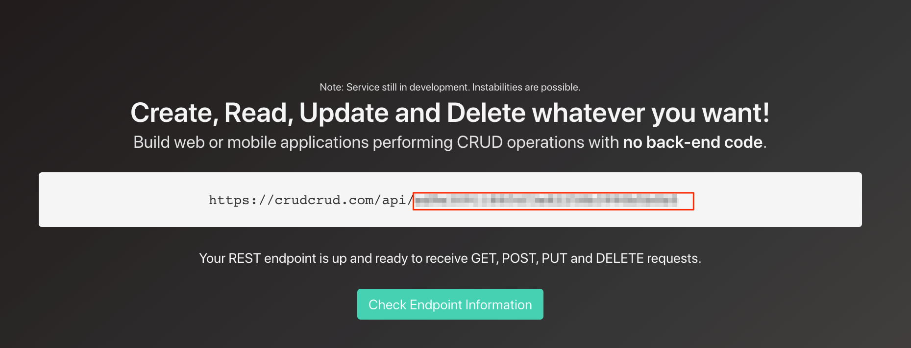
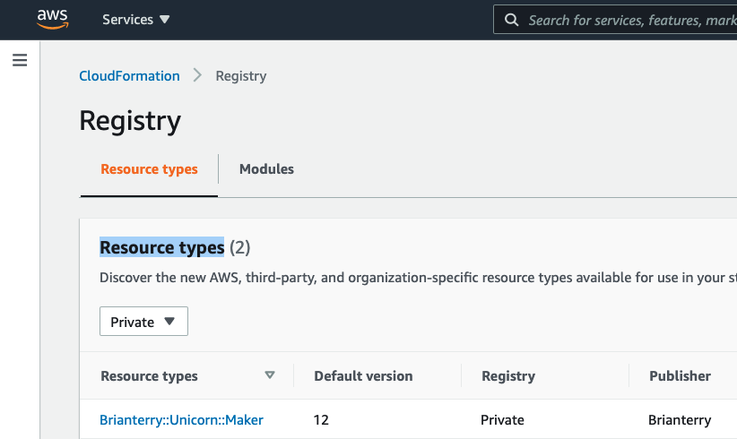

The unicorn-maker project is a repository that contains an end-to-end example of an AWS Cloudformation resource type.

The CloudFormation Command Line Interface (CLI) is an open-source tool that enables you to develop and test AWS and third-party resource types and register them for use in AWS CloudFormation.

# Overview
Welcome to the unicorn-maker project!

What is a CloudFormation resource provider? Excellent question! AWS CloudFormation introduced a set of capabilities that made it easy to model and automate third-party resources such as SaaS monitoring or incident management tools with infrastructure-as-code benefits.

With this launch, you can use AWS CloudFormation as a single tool to automate the provisioning of your infrastructure and application resources, whether AWS or third party, without the need for custom scripts or manual processes. You can now create your own private AWS CloudFormation resource providers, share them with the open-source community, and leverage third-party providers developed by others.

Cool, right?  How do I get started? Wow, you are full of great questions. I built this project to help you get started. In this repository, you will find an example of an AWS Cloudformation resource provider that you can use as an example.

# Getting Started

## Step 1: prerequisites
You can build the resource type with one of four languages: Java, Go, Python, and TypeScript. So I will assume that you have installed the language prerequisites you will be using to create your resource type.

First, start by installing the AWS Cloudformation CLI and the language plugins.

Although not necessary, I recommend creating a Python virtual environment. It makes getting started a little easier:

    $ python3 -m venv env
    $ source env/bin/activate

Now, install the AWS CloudFormation CLI and language plugins:

    (env)$ pip install cloudformation-cli cloudformation-cli-java-plugin cloudformation-cli-go-plugin cloudformation-cli-python-plugin

## Step 2: Choose Your Path
What's great about creating an AWS CloudFormation provider is you can write it in JAVA, Go, Python, TypeScript.

In this repo, you will find a folder that contains an example resource type built in the following languages:

[Go](https://github.com/brianterry/unicorn-maker/tree/master/go)

[Python](https://github.com/brianterry/unicorn-maker/tree/master/python)

[TypeScript](https://github.com/brianterry/unicorn-maker/tree/master/typescript)

Java (Coming soon)

No matter what path you choose, the resource design is the same. That way, you can use this project as a "rosetta stone."

For example, if you are good at Go and want to learn how to create a Python provider, compare the projects.

## Step 3: Configure The Backend Service
This provider uses [CrudCrud](https://crudcrud.com/) as the backend, enabling you to focus on provider creation instead of standing up an API.

Let's setup the backend. Start by going to [https://crudcrud.com/](https://crudcrud.com/) and obtain a CrudCrud API key. Don't worry—the free version provides more than enough requests to play with this example.

Copy API key, you well need this later.

## Step 4: Build the Resource Type
Now, it's time to build and deploy the provider.

Begin by picking a language and change directory into that project:

    (env)$ cd language-folder

Because the repo contains an example in each language, the build process is different between them. Please follow each project's directions to learn more about the prerequisites and how to perform a build.

## Step 5: Submit the Resource Type
Once the resource type is built, submit it using the CloudFormation CLI tool:

    (env)$ cfn submit

After a few minutes, the `Brianterry::Unicorn::Maker` resource will be displayed in your AWS CloudFormation console under private Resource types:

## Step 6: Create a Unicorn
Using the [CloudFormation](deployment/cloudformation.json) template in the `deployment` folder, create new stack that contains a uncorn:

The following command creates a new stack by using the cloudformation.json template.

    (env)$ aws cloudformation deploy --template deployment/cloudformation.json --stack-name my-unicorn

Now, jump over to your [https://crudcrud.com/](https://crudcrud.com/) to see your new unicorn!

# License

Unicorn maker is released under the MIT license. See [LICENSE.txt](https://github.com/brianterry/unicorn-maker/blob/master/LICENSE)

